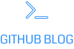

<p align="center">
  
</p>

<h1 align="center">Coffee Delivery</h1>

Bem-vindo ao projeto Gibhub Blog, feito com React! Este é um dos meus projetos nessa tecnologia e é uma aplicação simples para gerenciar um carrinho de compras de uma cafeteria fictícia, desenvolvida com uso de algumas bibliotecas adicionais de suporte, utilizando principalmente as funcionalidades nativas do React.

<h4 align="center"> 
	✅ React 🚀 Concluído ✅
</h4>


### Features

- [x] Consumo da api do github
- [x] Visualização das informações de usuário
- [x] Listagem das issues de um repositório
- [x] Mostrar os detalhes de cada issue


### Principais Ferramentas
- [Styled-component](https://styled-components.com)
- [React-router-dom](https://reactrouter.com/en/main)
- [Fontawesome](https://fontawesome.com)
- [Github-API](https://api.github.com)


### Pré-requisitos

Antes de começar, você vai precisar ter instalado em sua máquina as seguintes ferramentas:
[Git](https://git-scm.com), [Node.js](https://nodejs.org/en/).
Além disto é bom ter um editor para trabalhar com o código como [VSCode](https://code.visualstudio.com/)


### 🎲 Rodando a aplicação

```bash
# Clone este repositório
$ git clone https://github.com/allan-verde/desafio02-trilha-reactjs.git

# Acesse a pasta do projeto no terminal/cmd
$ cd desafio02-trilha-reactjs

# Instale as dependências
$ npm i

# Execute a aplicação em modo de desenvolvimento
$ npm run dev
```


### 🛠 Tecnologias

As seguintes ferramentas foram usadas na construção do projeto:

- [Node.js](https://nodejs.org/en/)
- [React](https://pt-br.reactjs.org/)
- [TypeScript](https://www.typescriptlang.org/)


### Resultado final
- [Vercel](https://github-blog-teal-kappa.vercel.app)


### Autor
---


🚀 Feito com ❤️ por Allan Verde 👋🏽 Entre em contato!

[]([https://www.linkedin.com/in/tgmarinho/](https://www.linkedin.com/in/allan-verde/)) 
[](mailto:allangreen2906@gmail.com)

---

### Licença 📝
Este projeto esta sobe a licença MIT.


### Agradecimentos! 🤗
Obrigado [Rocketseat](https://rocketseat.com.br/), gostei muito do desafio proposto!
